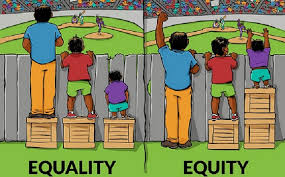

## Responses to Automating Inequality

**How do technical tools promise to "fair out" the remaining discrimination that exist in social/welfare systems? In how far can they succeed, in which ways do they fail?**

Technical tools, initially, are designed to be objective and neutral, which means they are supposed to avoid discrimination. They do “fair out” some bias, but to some other extent they are creating bias at the same time. The podcast reminds me of this image from Public Health Notes:

What technical tools offer is similar to the EQUALITY shown in the image: same, average, but cause different outcomes. As Virginia Eubanks said in the podcast, if one fail to meet online, the computer will think he/she as fail to cooperate, which will make he/she out of the system. Technology offers same evaluation to everyone. It is objective, but it not human-based. Errors may exist when situation is more complicated than either/or judgments. The data glitch that Eubanks encountered which suggested that her partner’s health insurance is invalid is an example. Technology fails in dealing with some human-centered issues, as human activity is complex. Only when technology can do what is called EQUITY, as in the image, can the system succeed. That is to say, if technology can distinguish different situation among people and offer relevant help neutrally without bias, the whole system would become better.

**Imagine, what could this (following quotes) mean in the widest sense?
"The state doesn't need a cop to kill a person" and "electronic incarceration"**

The worst situation to be imagined is the combination of human and technology, because computers can make better decision accurately, while human can design special programs for computers. There is an example in the podcast that a woman failed to get help from her health care system due to some technical problems, and it proved to be an error 3 days after her death from cancer. What if the error is deliberate by someone that wants her death? Digital tools are rationalizing some manmade problems and discriminations.

**What do you understand this to mean?
"systems act as a kind of 'empathy-overwrite'"**

This is still the problem of that digital tools are rationalizing discriminations. Technology has its own algorithm, as is suggested in the podcast, to determine whether a person is worthy of helping or not. With the “help” of human designing, the process that rationalize discriminations can overwrite the situation or the health care for a person. You are what the computer says you are.

**China is much more advanced and expansive when it comes to applying technical solutions to societal processes or instant challenges (recent example). Try to point example cases in China that are in accordance or in opposition to the problematics discussed in the podcast. Perhaps you can think of
"technical systems not well thought-through about what their impace on human beings is"**

People are starting to get back to work these days and in Shanghai most office buildings require workers to scan a QR code when they enter the building through an application. By scanning the QR code one’s data including when and where have he/she been will be acquired. In terms of the corona virus, I believe it is an effective way to control, especially in such a large city where so many people are coming back to work at the same time. On the other hand, it seems that many information, such as one’s travel history, have already been known, as people do not need to enter their travel history manually, but the information would automatically be acquired. This reminds me of the word “target” in the podcast. We are under control everywhere; we are targets instead of clients.

**Citations**
Adhikari, Sandesh. “Equity Vs Equality: 20 differences between Equity and Equality!”,	Public Health Notes. May 6, 2017.
https://www.publichealthnotes.com/equity-vs-equality/
Rheannon, Francesca. “Virginia Eubanks, AUTOMATING INEQUALITY”, Writer’s	Voice. Oct 18, 2019. https://www.writersvoice.net/tag/virginia-eubanks/
